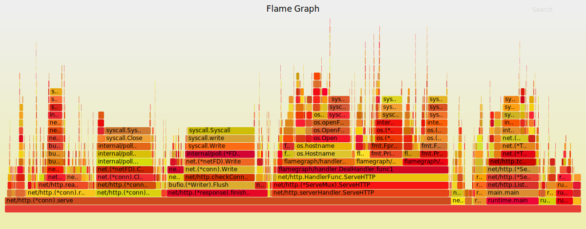

## Flame Graphs in Go

**Yankun 28th Oct. 2018**


#### Amdahl's law

*Amdahl's law* is a formula which gives the theoretical speedup in latency of the execution of a task at fixed workload that can be expected of a system whose resources are improved. Named after computer scientist *Gene Amdahl*.
$$
S_{latency}(s)=\frac{1}{(1-p)+\frac{p}{s}}
$$

- ***S*** is the theoretical speedup of the execution of the whole task;
- ***s*** is the speedup of the part of the task that benefits from improved system resources;
- ***p*** is the proportion of execution time that the part benefiting from improved resources originally occupied.


#### Profiling

**CPU Profiling**

Record stacks at a timed interval: simple, effective and low overhead, but coarse accuracy.

**Go profiling**

- **Use benchmark file** - Use the command `go test . -bench . -cpuprofile prof.cpu` to generate the sample file, then use the command `go tool pprof [binary] [profile]`  to analyze it.
- **import _ net/http/pprof** - If the application is a web service, we can add `import _ net/http/pprof` to the code file, so that our service can automatically open the profile function, which helps us directly analyze the sampling results.
- **runtime.StartCPUProfile / runtime.WriteHeapProfile**

By using Go's profiling tools to identify and correct specific bottlenecks, we can make the Go loop finding program run an order of magnitude faster and use 6x less memory.

> **Tips**
>
> - Develop in an iterative and incremental way. Pre-optimization could be relatively one-sided.It is  recommended to build the function first, and then comes to optimazation.
> - Write a benchmark test for the hotspot, with the usage of  -benchmem flag and memory profile to observe the frequency memory allocations.


#### Golang

**Go** is a programming language designed by Google engineers *Robert Griesemer*, *Rob Pike*, and *Ken Thompson*. 

Go is a statically typed, compiled language in the tradition of C, with the added benefits of memory safety, garbage collection, structural typing, and CSP-style concurrency. 

The compiler, tools, and source code are all free and open source.

Many open source projects are developed with golang, including *go-Ethereum*, *Terraform*, *Docker*.


#### Flame Graphs 

*Brendan Gregg* is a kernel and performance engineer at Netflix, known for his work in systems performance analysis. 

Known worldwide as *shouting guy* [[origin/Youtube]](https://www.youtube.com/watch?v=tDacjrSCeq4).

*Flame graph* are a visualization of profiled software, allowing the most frequent code-paths to be identified quickly and accurately. Brendan Gregg gave a talk of the brand new tool on 12th Nov. 2013 [[resource]](https://www.usenix.org/conference/lisa13/technical-sessions).

Made from Perl, SVG, JavaScript.

[](data/pprof.svg)

The x-axis shows the stack profile population, sorted alphabetically, and the y-axis shows stack depth. Each rectangle represents a stack frame. The wider a frame is is, the more often it was present in the stacks. 

The top edge shows what is on-CPU, and beneath it is its ancestry. 

The colors are usually not significant, picked randomly to differentiate frames.


Here comes the detailed steps when using the flame graphs.

1. **Configuring the FlameGraph script**

Download from Brendan's repositry and copy to a $PATH folder.

```shell
$ git clone https://github.com/brendangregg/FlameGraph.git
$ sudo cp ./FlameGraph/flamegraph.pl /usr/local/bin
```

Check the setup of flamegraph.

```shell
$ flamegraph.pl -h
Option h is ambiguous (hash, height, help)
USAGE: /usr/local/bin/flamegraph.pl [options] infile > outfile.svg
...
```

2. **Configure go-torch**

go-torch is a flame graph profiler developed by uber.

If you are using Go 1.10 or higher version, the visialization can completely be conducted with `go tool pprof`, while go-torch can be deprecated.

```shell
$ go get -v github.com/uber/go-torch
$ go-torch -h
Usage:
  go-torch [options][binary] <profile source>
...
```

3. **Configure benchmark tool**

```shell
$ go get -v github.com/adjust/go-wrk
$ go-wrk -h
Usage of go-wrk:
...
```

Other benchmark tools like Vegeta can be used.

4. **Figure the sample server program**

Here is a segment of the main.go file, where `http.ListenAndServe()` starts a server and `http.HandleFunc` defines the operation when request detected.

The `index()` gives us a example what the reponse exactly contains when a request binding the `/`.

```go
func main() {
	flag.Parse()

	// Listen
	http.HandleFunc("/stats", handler.DealHandler(handler.Msg))
	http.HandleFunc("/", index)

	fmt.Println("Server started on", hostPort)
	if err := http.ListenAndServe(hostPort, nil); err != nil {
		log.Fatalf("HTTP Server Failed: %v", err)
	}
}

func index(w http.ResponseWriter, _ *http.Request) {
	w.Header().Set("Content-type", "text/html")
	fmt.Fprintf(w, `<a href="%v">%v</a>`, "stats", "check")
}
```

`import  _ "net/http/pprof"` needed for pprof .

5. **Stack traces with pprof**

We can try to fetch the stack traces procedure with go tool pprof.

Run the server and start the go-wrk benchmark test. Use the pprof tool to listen to the `http://localhost:8080/debug/pprof/profile`.

```shell
(console 1)$ go run main.go -stats
(concole 2)$ go-wrk -c 200 -t 4 -n 100000 http://localhost:8080/stats
(console 3)$ go tool pprof --seconds 15 http://localhost:8080/debug/pprof/profile
```

When we got these information, print "web" and we got a svg file in browser.

```txt
Fetching profile over HTTP from http://localhost:8080/debug/pprof/profile?seconds=15
Please wait... (15s)
Saved profile in /home/kun/pprof/pprof.main.samples.cpu.035.pb.gz
File: main
Type: cpu
Time: Oct 25, 2018 at 10:06am (CST)
Duration: 14.98s, Total samples = 10.98s (73.29%)
Entering interactive mode (type "help" for commands, "o" for options)
(pprof) web

```

We can get the output of a complete program stack traces sampling profile.


This type of diagram has a shortcoming, which is that, when level becomes deep, the hierarchical relationship is a bit unfriendly. We may need to show another way to tell us if there is a problem with the app.

6. **Stack traces with flame graphs**

Now we can use go-torch to generate the visiualization of stack traces. go-torch will call and transfer the flag to the pprof tools.

```shell
(console 1)$ go run main.go -stats
(console 2)$ go-wrk -c 200 -t 4 -n 100000  http://localhost:8080/stats
(console 3)$ go-torch -u http://localhost:8080 -t 15
```

When we got this information, a svg file named "torch.svg" will be generated in current directory. We can observe it with broswer.

```text
INFO[10:33:26] Run pprof command: go tool pprof -raw -seconds 15 http://localhost:8080/debug/pprof/profile
INFO[10:33:41] Writing svg to torch.svg
```


Based on the flame graphs, we can optimize the details of the code.

Use the "Search" on the up right to locate the function we need to modify. The length shows the overhead functions comsumed in CPU. And the sampling detail will show up under the bar graph when specific function was tapped. We can diagnose our code based on the overhead, the sampling, the percentage of time used to optimize the performance.


#### Reference

- Profiling Go Programs - Go Document [[Official]](https://blog.golang.org/profiling-go-programs)

- Flame Graphs - Brendan Gregg [[Blog]](http://www.brendangregg.com/flamegraphs.html)

- USENIX ATC '17: Visualizing Performance with Flame Graphs [Video] - Brendan Gregg [[Youtube]](https://www.youtube.com/watch?v=D53T1Ejig1Q)

- USENIX ATC '17: Visualizing Performance with Flame Graphs [Slices] - Brendan Gregg [[PDF]](http://www.brendangregg.com/Slides/USENIX_ATC2017_flamegraphs.pdf)


#### Glossary

- **SVG** is an XML-based vector image format for two-dimensional graphics with support for interactivity and animation.
- **DevOps** is a software development methodology that combines software development (Dev) with information technology operations (Ops). 

- **Profiling** is a form of dynamic program analysis that measures, for example, the memory or time complexity of a program, the usage of particular instructions, or the frequency and duration of function calls.

- **CPU/Heap/Block Profiles** is data or figure sampled from runtime enviroment containing the process and thread call procedure and other dynamic states.

- **Stack Traces** is a report of the active stack frames at a certain point in time during the execution of a program. 


